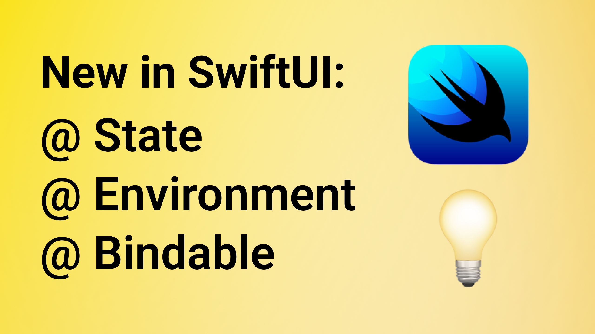

# SwiftUI: New Observation Framework

This is the code from the YT video "SwiftUI: New Observation Framework" 🤗

In this video, you will learn about the new Observation Framework introduced in iOS 17. Enjoy 🤓

## Links:
- [Link to the video](https://www.youtube.com/watch?v=VQC42iy2rG8)
- [Observation](https://developer.apple.com/documentation/observation)
- [Observable()](https://developer.apple.com/documentation/Observation/Observable())
- [Migrating from the Observable Object protocol to the Observable macro](https://developer.apple.com/documentation/swiftui/migrating-from-the-observable-object-protocol-to-the-observable-macro) 
